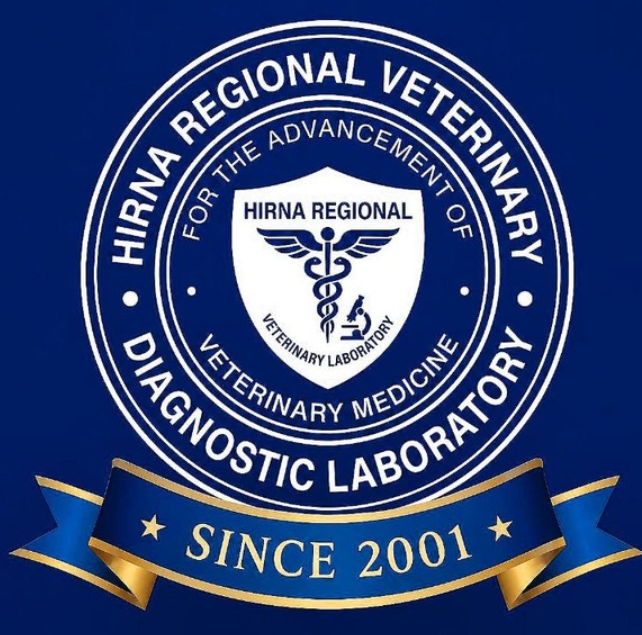

# HRVL Disease Analytics Dashboard

A production-ready veterinary disease surveillance dashboard for the **Hirna Regional Veterinary Diagnostic Laboratory (HRVL)**, Oromia, Ethiopia. Built with Next.js 16, React, TypeScript, Tailwind CSS 4, and shadcn/ui.



## Features

- **8 KPI Cards** with trend indicators (Total Reports, Outbreaks, Zero Reports, Compliance Rate, Cases, Deaths, Active Woredas, Active Outbreaks)
- **3 Reporting Rate Cards** (Overall / East Hararghe / West Hararghe)
- **Interactive Outbreak Map** with pulsing bubbles for active outbreaks (React-Leaflet + CARTO basemap)
- **Daily / Weekly / Monthly Reporting Trend** charts (bar + line composed charts)
- **Species Distribution Donut Chart** with 7 livestock species
- **Case Fatality Rate (CFR) Trend** line chart for 5 major diseases
- **Disease Summary Table** with search and pagination
- **Outbreak Details Table** with Morbidity, Mortality, CFR columns + sortable headers
- **Surveillance Records Table** with sortable headers + search
- **Woreda Reporting Compliance Table** with progress bars for all 36 woredas
- **Excel Import** with multi-sheet parsing, fuzzy woreda name matching, and auto date configuration
- **CSV Export** for all 4 tables
- **Dark / Light Mode** toggle with theme-aware charts and map tiles
- **Fully Responsive** — works on mobile, tablet, and desktop
- **Epidemiological Report Generator** with printable narrative summary

## Tech Stack

| Layer | Technology |
|-------|------------|
| Framework | Next.js 16 (App Router) |
| Language | TypeScript |
| Styling | Tailwind CSS 4 + shadcn/ui |
| Charts | Recharts |
| Maps | React-Leaflet + CARTO basemap |
| Excel parsing | SheetJS (xlsx) |
| Theme | next-themes |
| Icons | lucide-react |

## Live Demo

This is a **static export** — no server required. You can deploy it to any static hosting provider:

- GitHub Pages
- Netlify
- Vercel
- Cloudflare Pages
- Any static file server

## Deployment to GitHub Pages

1. **Create a new public repository** on GitHub (e.g., `hrvl-dashboard`).

2. **Push these files** to the repository:
   ```bash
   cd hrvl-dashboard
   git init
   git add .
   git commit -m "Initial commit: HRVL Disease Analytics Dashboard"
   git branch -M main
   git remote add origin https://github.com/<YOUR_USERNAME>/hrvl-dashboard.git
   git push -u origin main
   ```

3. **Enable GitHub Pages**:
   - Go to your repository on GitHub
   - Click **Settings** → **Pages**
   - Under **Source**, select **Deploy from a branch**
   - Select branch `main` and folder `/ (root)`
   - Click **Save**
   - Wait 1-2 minutes for the build to complete
   - Your dashboard will be live at: `https://<YOUR_USERNAME>.github.io/hrvl-dashboard/`

> **Note**: The `.nojekyll` file in this repo ensures GitHub Pages serves the `_next/` folder correctly (Jekyll ignores folders starting with `_` by default).

## Local Preview

You can preview the dashboard locally without any build step:

```bash
# Using Python's built-in HTTP server
python3 -m http.server 8000

# Or using Node's serve
npx serve .
```

Then open `http://localhost:8000` in your browser.

## Project Structure

```
hrvl-dashboard/
├── index.html                  # Main dashboard page
├── 404.html                     # Not-found page
├── _next/                       # Next.js assets (JS/CSS chunks)
├── hararghe_woredas.json        # GeoJSON for 36 woredas (East + West Hararghe)
├── hrvl-logo-new.png            # HRVL logo
├── logo.svg / logo-seal.svg     # Brand assets
├── robots.txt                   # SEO robots file
├── .nojekyll                    # Disables Jekyll on GitHub Pages
└── README.md                    # This file
```

## Excel Import Format

The dashboard accepts Excel files (`.xlsx`) with the following characteristics:

- **Sheet names** can include `Disease`, `Outbreak`, `Zero`, `Negative`, or any custom name
- **Auto-detects columns** by header name (case-insensitive):
  - `phone`, `region`, `zone`, `woreda`, `lat`, `lon`, `disease`, `species`, `cases`, `deaths`, `risk`, `comment`, `date`
- **Filters to Hararghe** — only East Hararghe (21 woredas) and West Hararghe (15 woredas) records are kept
- **Fuzzy woreda matching** — handles spelling variants like Bedeno/Badeno, Haramaya/Haro Maya, Gola Oda/Golo Oda, etc.
- **Auto-configures date range** — From/To date pickers automatically set to the min/max dates in the imported data

## Coverage

**36 Woredas across 2 Zones of Oromia, Ethiopia:**

- **East Hararghe (21)**: Babile, Badeno, Chinaksen, Dadar, Fedis, Girawa, Gola Oda, Goro Gutu, Gursum, Haramaya, Jarso, Kersa, Kombolcha, Kurfa Chele, Malka Balo, Meyu Muluke, Meta, Midega Tola, Kumbi, Goro Muti, Makanisa Oromoo
- **West Hararghe (15)**: Boke, Oda Bultum, Chiro, Daro Lebu, Doba, Habro, Gamachis, Guba Koricha, Mesela, Mieso, Tulo, Gumbi Bordode, Burqa Dhintu, Anchar, Hawwi Gudina

## Contact

**Hirna Regional Veterinary Laboratory**
- Phone: +251 933 310 270
- Email: henz@hirnarvl.onmicrosoft.com
- Location: Oromia, Ethiopia

## License

MIT License — feel free to use, modify, and distribute.
